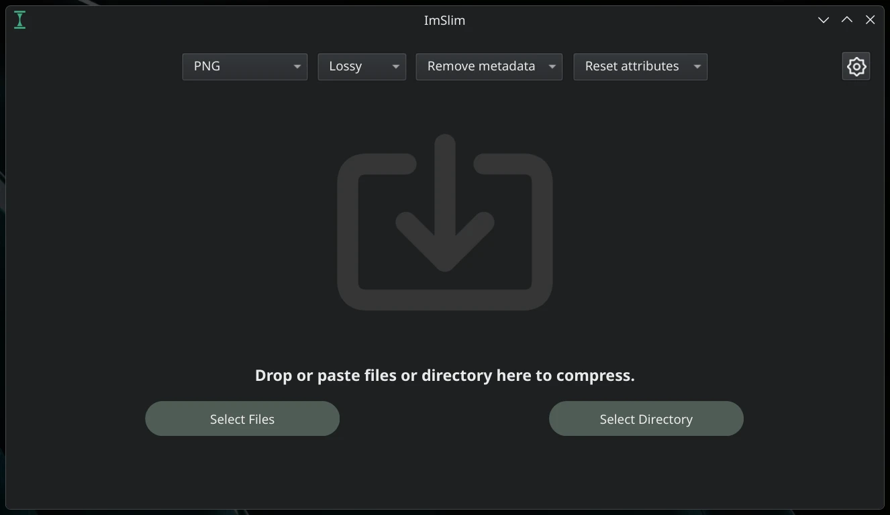
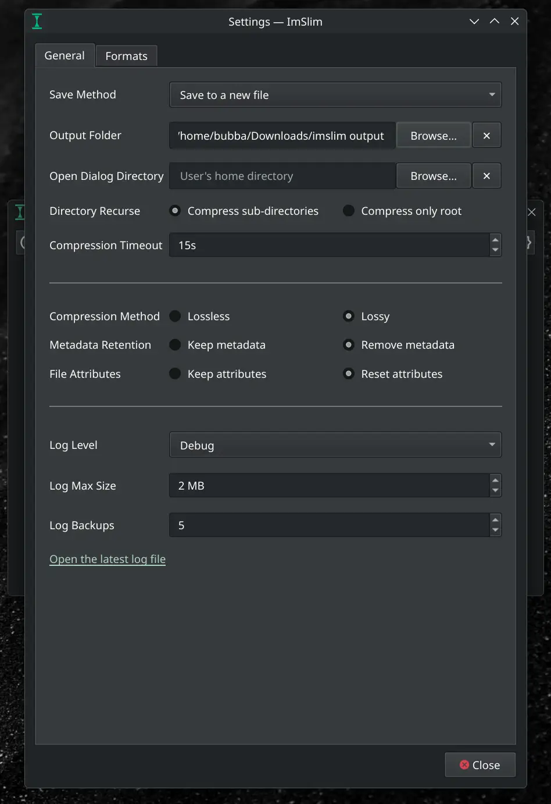
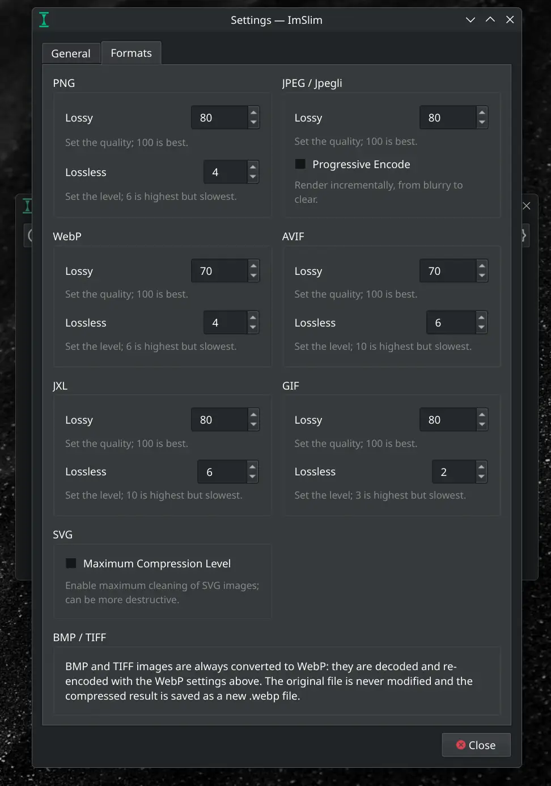
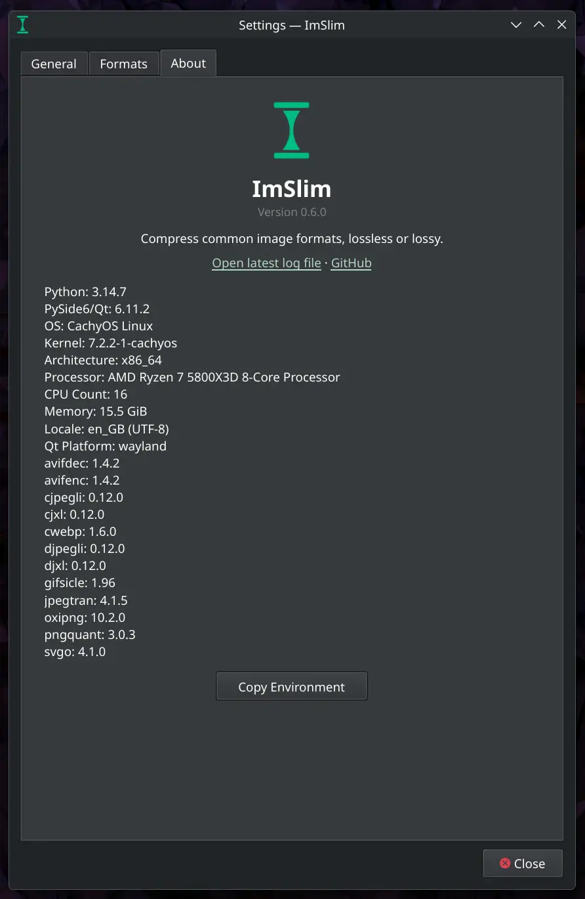

# ImSlim

A Linux-first image compressor. Compress common image formats. Built on top of gold standard image processing libraries using Python / PySide6.

Inspired by [Curtail](https://github.com/Huluti/Curtail).


  

## Features

- compress common image formats (PNG, JPEG, GIF, WebP, AVIF, JXL, SVG) lossless or lossy.
- BMP + TIFF are always encoded to WebP (as per selected settings).
- animated GIFs are always compressed losslessly.
- optionally strip metadata (EXIF/XMP/JUMBF), reset file attributes.
- save output to new files or backup->overwrite originals.
- recurse directories for batch compression.

## Tech Stack

Built with Python / PySide6. The compression libraries are built from source, latest releases:

- [libjxl](https://github.com/libjxl/libjxl) (`cjxl`/`djxl`)
- [jpegli](https://github.com/google/jpegli) (`cjpegli`/`djpegli`)
- [mozjpeg](https://github.com/mozilla/mozjpeg) (`jpegtran`)
- [oxipng](https://github.com/shssoichiro/oxipng)
- [pngquant](https://pngquant.org)
- [libwebp](https://developers.google.com/speed/webp) (`cwebp`)
- [libavif](https://github.com/AOMediaCodec/libavif) (`avifenc`/`avifdec`)
- [gifsicle](https://www.lcdf.org/gifsicle/)
- [svgo](https://github.com/svg/svgo)

---

## Development

See `Makefile` for details:

```sh
make init          # runs uv sync, installs deps
make build         # package / build the app
make upgrade       # refresh dependency lockfile to newest versions
make tools         # runs build / update script for image libraries
make check         # runs ruff check + basedpyright
make clean         # remove all build artifacts
make format        # runs ruff format
make fix           # auto fix lint issues
make run           # runs the app
make bump          # bump version + changelog via cog (cocogitto)
make install       # install locally (installs even if version unchanged)
```

> [!NOTE]
> `make install`: creates a desktop entry that declares the app as a handler for supported image types. It is KDE-specific due to `kbuildsycoca6`.

## License

[GNU General Public License v3](LICENSE)
